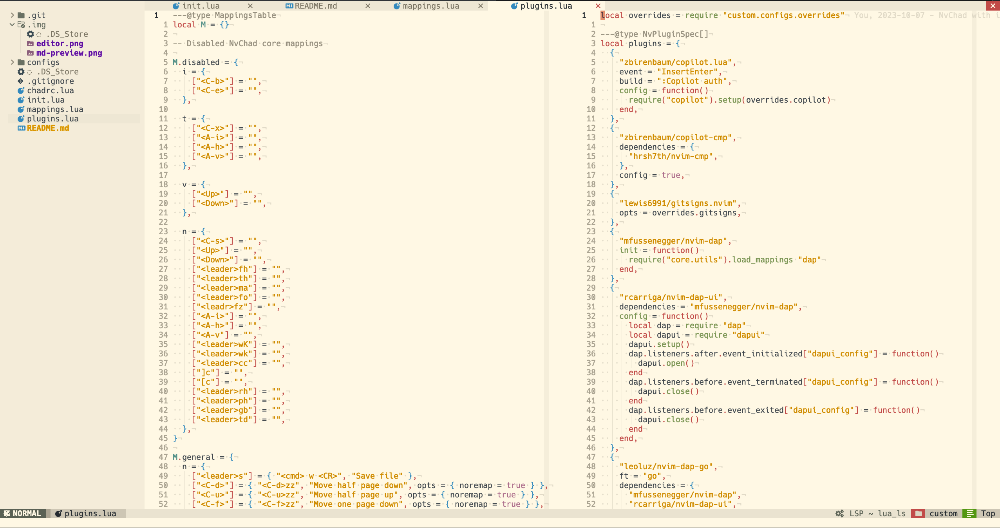

# nvim config

Configuration for [Neovim](https://github.com/neovim/neovim/releases/tag/v0.9.0),
based on the [NvChad](https://nvchad.com/) distribution.

## Preview

### Editor



### Debugger


### Github Copilot


### Search


### Git commits


### Markdown Preview


### Cheatsheet


## Features

Language Support:

- Autocompletion and suggestions for:
  - Bash/Zsh
  - C/C++
  - Go
  - Lua
  - Markdown
  - Python
  - Terraform
  - Typescript
  - YAML
- Autoformatting on save for:
  - Bash/Zsh
  - C/C++
  - CSS
  - Go
  - GraphQL
  - HTML
  - Javascript
  - Lua
  - Markdown
  - Python
  - Ruby
  - SCSS
  - Terraform
  - Typescript
  - YAML
- Linting
  - Markdown
  - Terraform
- Debugging for:
  - Go
  - Python
- Syntaxt highlight for:
  - Bash/Zsh
  - C/C++
  - CSS
  - CSV
  - Diff
  - Dockerfile
  - Go
  - gitconfig
  - gitignore
  - GraphQL
  - HCL
  - HTML
  - Javascript
  - JSON
  - Lua
  - Make
  - Markdown
  - Python
  - Ruby
  - SCSS
  - SQL
  - Terraform
  - TOML
  - Typescript
  - YAML

NvimTree:

- NvimTree open by default
- NvimTree git support
- Hide dot files by default for NVimTree

Editor:

- Inline git blame
- Ruler at 80th character
- Show by default relative line numbers
- Identation guides

Other:

- Github Copilot
- Markdown Preview
- Horizontal terminal height at 50%
- Hidden theme toggle

## Installation

### Pre-requisites

- [Neovim 0.9.0](https://github.com/neovim/neovim/releases/tag/v0.9.0)
- [Nerd Font](https://www.nerdfonts.com/)
- [Ripgrep](https://github.com/BurntSushi/ripgrep)
- [Glow](https://github.com/charmbracelet/glow)
- [Terraform](https://www.terraform.io/)

Install by running:

```bash
# remove existing configs
rm -rf ~/.config/nvim
rm -rf ~/.local/share/nvim

# install NvChad
git clone https://github.com/NvChad/NvChad ~/.config/nvim --depth 1
# install custom nvim configuration
git clone https://github.com/le4ker/nvim-config ~/.config/nvim/lua/custom
nvim
```
